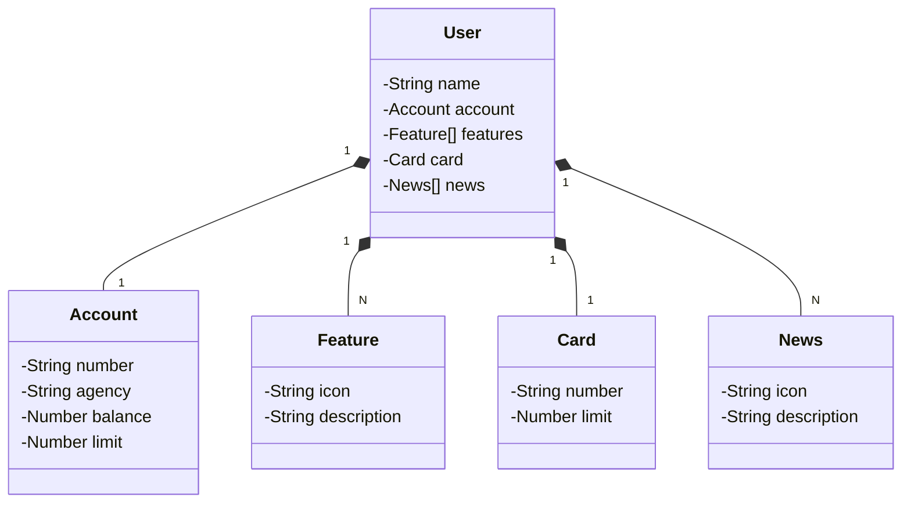

# sdw2023-api
Uma API REST feita com Java e o framework Spring para a **Santander Dev Week 2023**.
No evento foram usadas diversas tecnologias para recriar as telas dos aplicativos do Santander em diferentes plataformas.

Essa aplicação implementa CRUD de dados de usuários do banco, e opera de acordo com as requisições das aplicações *front-end*.
Seus *endpoints* estão documentados em https://sdw2023-api.up.railway.app/swagger-ui.html.

## Diagrama de classes

